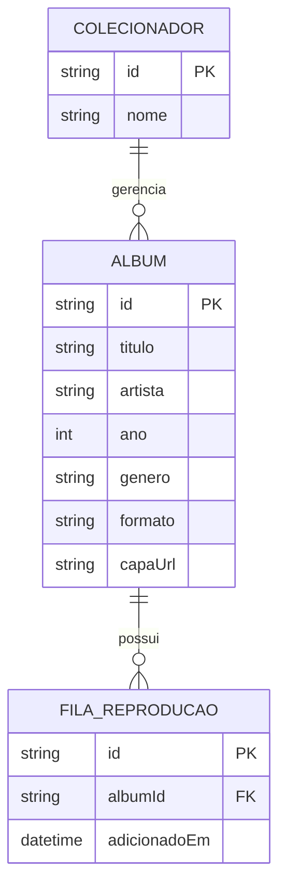

# Especificação Técnica e Arquitetura - Minha Discoteca

## 1. Modelo de Dados (Diagrama ER)

## 2. Design Tokens
### Paleta de Cores
* Fundo da Aplicação: Gradiente escuro (Vinho #4A0E0E a Roxo Escuro #0F051A).

* Cards (Estante de Discos): Marrom amadeirado (#5D4037).

* Cor de Destaque (Botões e Links): Dourado (#D4AF37).

* Texto Principal: Branco (#FFFFFF).

### Tipografia
* Títulos (Headings): Playfair Display

* Textos Normais (Body): Montserrat

## 3. Protótipo Interativo
* Figma / Stitch.AI: https://stitch.withgoogle.com/projects/14965960484826854438
