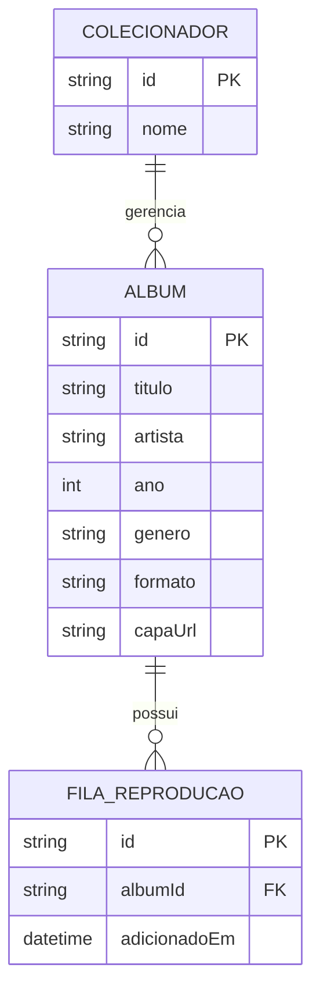

# Especificação Técnica e Arquitetura - Minha Discoteca

## 1. Modelo de Dados (Diagrama ER)


## 2. Design Tokens
### Paleta de Cores
* Fundo da Aplicação: Gradiente escuro (Vinho #4A0E0E a Roxo Escuro #0F051A).

* Cards (Estante de Discos): Marrom amadeirado (#5D4037).

* Cor de Destaque (Botões e Links): Dourado (#D4AF37).

* Texto Principal: Branco (#FFFFFF).

### Tipografia
* Títulos (Headings): Playfair Display

* Textos Normais (Body): Montserrat

## 3. Protótipo Interativo
* Figma / Stitch.AI: https://stitch.withgoogle.com/projects/14965960484826854438
  
## 4. Dicionário de Dados

Detalhamento dos atributos que compõem a entidade principal do nosso sistema.

### Entidade: Álbum
| Campo | Tipo | Obrigatório | Descrição |
| :--- | :--- | :---: | :--- |
| `id` | String | Sim | Identificador único gerado automaticamente. |
| `titulo` | String | Sim | Nome oficial do álbum. |
| `artista` | String | Sim | Nome da banda, artista principal ou grupo. |
| `ano` | Number | Não | Ano de lançamento original. |
| `genero` | String | Sim | Gênero musical (ex: Jazz, Rock, MPB). |
| `formato` | String | Sim | Tipo de mídia física (Vinil, CD, K7). |
| `capaUrl` | String | Não | URL da imagem da capa em alta resolução. |

---

## 5. Mapeamento de Rotas (APIs)

O sistema fará uso de duas frentes de consumo de dados: uma API pública para enriquecimento e um Mock Backend para persistência.

### API Externa (iTunes Search API)
Responsável por buscar capas e dados originais dos álbuns (Atende ao **ID 24**).
* **`GET`** `https://itunes.apple.com/search?term={TERMO_DE_BUSCA}&entity=album`
  * *Descrição:* Retorna uma lista de álbuns correspondentes à busca. O parâmetro `term` deve conter o nome do artista ou álbum (espaços substituídos por `+`).

### Mock Backend (JSON Server)
Responsável por simular nosso servidor local (Atende aos **IDs 22 e 23**).
* **Base URL:** `http://localhost:3000`
* **`GET /albuns`**: Retorna a lista completa do acervo salvo.
* **`POST /albuns`**: Cadastra um novo disco na estante.
* **`PUT /albuns/:id`**: Atualiza as informações de um disco existente.
* **`DELETE /albuns/:id`**: Remove um disco da coleção.
* **`GET /fila`**: Retorna os itens adicionados à fila de reprodução.

---

## 6. Estrutura do Banco de Dados (db.json)

Como utilizaremos o **JSON Server** para simular nosso banco de dados relacional, a persistência ocorrerá em um arquivo estático `db.json` localizado na raiz do projeto. O esqueleto inicial será este:

```json
{
  "albuns": [
    {
      "id": "1",
      "titulo": "Kind of Blue",
      "artista": "Miles Davis",
      "ano": 1959,
      "genero": "Jazz",
      "formato": "Vinil",
      "capaUrl": "[https://exemplo.com/kind-of-blue.jpg](https://exemplo.com/kind-of-blue.jpg)"
    }
  ],
  "fila": []
}
